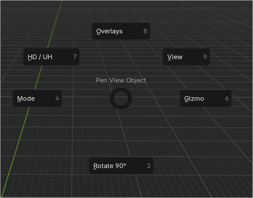
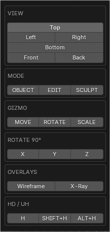

# Pen View

Pen View is a lightweight Blender add-on designed to improve viewport navigation and workflow for pen tablet users, compact keyboards, and laptops without a numeric keypad.

The add-on provides quick access to common view, mode, and overlay tools through a customizable interface, allowing users to choose between a Pie Menu or a floating Popup UI.

⚠️ This add-on requires classic Blender add-on installation to enable both interface modes.

---

## Features

- View orientation controls (Top, Front, Side, Bottom)
- Quick access to Object, Edit, and Sculpt modes
- Mesh selection mode buttons (Vertex, Edge, Face) in Edit Mode
- Overlay toggles for Wireframe, X-Ray, and Face Orientation
- Two interface modes: Pie Menu or Popup
- Designed for pen tablets and laptops without numpad

---

## Interface Modes

Pen View offers two interface styles:

- **Pie Menu UI**  
  Radial menu optimized for pen tablet workflows and fast directional access.

- **Popup UI**  
  Lightweight floating popup displayed at the cursor position.

The interface mode can be selected in the add-on preferences.

<table align="center">
  <tr>
    <td align="center">
      
       <b>Pie menu</b>
    </td>
    <td align="center">
      
       <b>Popup</b>
    </td>
  </tr>
</table>

---

## Installation (Required)

Pen View must be installed as a classic Blender add-on.

Blender Extensions currently do not support Add-on Preferences, which are required to switch between the Pie Menu and Popup interface modes.

### Correct installation method

1. Download the repository as a ZIP file from GitHub.
2. Open Blender.
3. Go to Edit → Preferences → Add-ons.
4. Click Install…
5. Select the downloaded ZIP file.
6. Enable the Pen View add-on.
7. Open the add-on preferences and select the desired interface mode.

---

## Unsupported installation method

Installing Pen View through Blender Extensions will result in a limited version where interface preferences are not available.

This is a current limitation of Blender Extensions, not a bug in the add-on.

---

## Usage

The add-on is accessed via a custom shortcut assigned by the user.

The shortcut opens either the Pie Menu or the Popup UI at the cursor position, depending on the selected interface mode.

All tools are executed directly and do not override Blender’s default keymap behavior.

---

## UI Location

- Shortcut-only interface (no permanent panels)

---

## Blender Version

- Blender 5.0 or newer

---

## License

GNU General Public License v3 or later (GPL-3.0-or-later)
